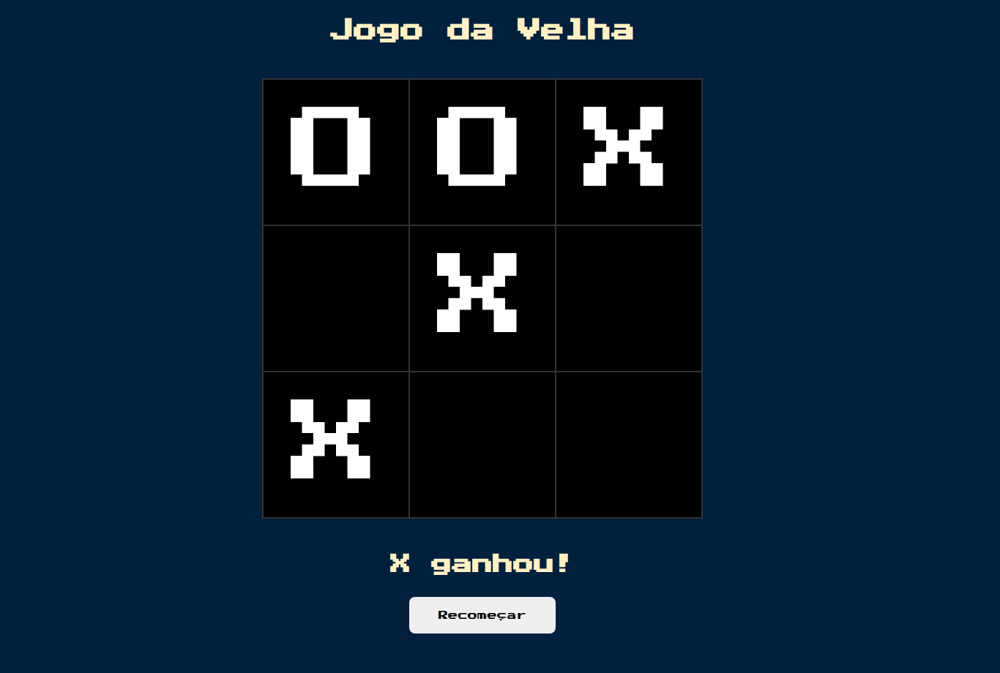

<div align="center">
  <h1>Tic-Tac-Toe</h1>
</div>

<div align="center">
  
</div>

#####

<p align="center">An instance of the Tic-Tac-Toe game</p>

## 🛠️ Technologies

<ul>
  <li><a href="https://www.javascript.com/">JavaScript</a></li>
</ul>

## ⚙️ Requirements

<ul>
  <li><a href="https://git-scm.com/">Git</a></li>
</ul>

## 🚀 Installation

```bash
$ git clone https://github.com/gabrielsanttana/tic-tac-toe
```

To run the game, simply open the `index.html` file.
